# Django tutorial liwbh
Es un resumen del ["tutorial oficial"](https://docs.djangoproject.com/en/5.0/) de la pagina de django

## Contenido del tutorial
* [Parte 1 creando aplicacion en Django](#parte-1-creando-aplicacion-en-django)
* [Parte 2 Configuración de base de datos](#parte-2-configuración-de-base-de-datos)
* [Parte 3 Vistas y rutas](#parte-3-vistas-y-rutas)
* [Parte 4 Implementación de interación con la pagina y datos en bd](#parte-4-implementación-de-interación-con-la-pagina-y-datos-en-bd)
* [Parte 5 Pruebas automatizadas](#parte-5-pruebas-automatizadas)
* [Parte 6 Archivos estaticos](#parte-6-archivos-estaticos)
* [Parte 7 Personalizar formulario de administración](#parte-7-personalizar-formulario-de-administración)
* [Parte 8 Debug Toolbar](#parte-8-debug-toolbar)
* [Tutorial avanzado: Crear aplicaciones reutilizables](#tutorial-avanzado-crear-aplicaciones-reutilizables)
* [Obtener ayuda de otro](#obtener-ayuda-de-otros)
* [Extras](#extras)
* [Lista de comandos Django](#lista-de-comandos-django)


## Parte 1 creando aplicacion en Django

- Instalación de python
- Crear proyecto

```
    django-admin startproject mysite
```

Esto creará un mysite directorio en su directorio actual.

- Crear entorno virtual

```
    python -m venv ./venv
 ```

- Activar el entorno vitual

```
    python -m venv ./venv/bin/activate
```

- Verificar el funcionamiento del servidor

```
    python manage.py runserver
```

- Crear aplicación

```
    python manage.py startapp myapp
```

- Agregar aplicación al pryecto

Directorio: mysite/settings.py

```
    INSTALLED_APPS = [
        ...
        'myapp',
    ]
```

- Crear vista

Directorio: myapp/views.py

```
    from django.http import HttpResponse
    
    def index(request):
        return HttpResponse("Hello, world. You're at the polls index.")
```

- Crear url

Directorio: myapp/urls.py

```
    from django.urls import path
    
    from . import views
    
    urlpatterns = [
        path("", views.index, name="index"),
    ]
```

- Agregar las url de una app al proyecto

Directorio: mysite/urls.py

```
    from django.contrib import admin
    from django.urls import include, path
    
    urlpatterns = [
        path("polls/", include("polls.urls")),
        path("admin/", admin.site.urls),
    ]
```

- Verificar que se puede acceder a la vista

```
    python manage.py runserver
```

url: http://localhost:8000/polls/

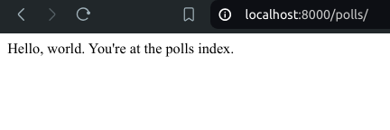

## Parte 2 Configuración de base de datos

Por defecto django tiene integrado la base de datos sqlite
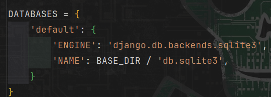

- Iniciar las tablas por defecto de django admin

```
python manage.py migrate
```

- crear un model para myapp

Directorio: myapp/models.py

```
from django.db import models

class Question(models.Model):
    question_text = models.CharField(max_length=200)
    pub_date = models.DateTimeField("date published")


class Choice(models.Model):
    question = models.ForeignKey(Question, on_delete=models.CASCADE)
    choice_text = models.CharField(max_length=200)
    votes = models.IntegerField(default=0)
```

- Crear migraciones implementadas en los models

```
    python manage.py makemigrations myapp
```

Directorio: myapp/migrations/
En el directorio mencionado almacenará las migraciones
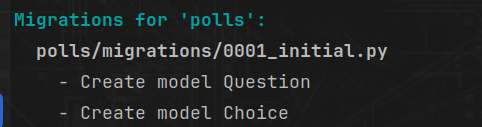

- Ver en consola una migracion

```
    python manage.py sqlmigrate myapp <id_migracion>
```

- Verificar la integridad del proyecto

```
    python manage.py check
```

- Crear tablas segun las migraciones

```
    python manage.py migrate
```

- Ingresar al shell para manipular bd

    ```
        python manage.py shell
    ```

   - Indicar las tablas 
    ```
        from polls.models import Choice, Question
    ```
    - Obtner todos los registros de un model asociado a una tabla
     ```
        Question.objects.all()
     ```
    - Establecer zona horaria
    ```
        from django.utils import timezone
    ```
    - crear un registro en bd
    ```
        q = Question(question_text="What's new?", pub_date=timezone.now())
    ```
    - Guardar 
    ```
        q.save()
    ```
    - Obtener el id del registro creado
    ```
        q.id
    ```
    - Acceder a atributos y sus valores
   ```
        q.question_text
        q.pub_date
    ```
    - Actualizar valores
     ```
        q.question_text = "What's up?"
        q.save()
     ```
    - Filtrar por id
    ```
        Question.objects.filter(id=1)
    ```
    - Filtrar por atributos
   ```
    Question.objects.filter(question_text__startswith="What")
   ```
   - Filtrar por pk o llave primaria
   ```
    Question.objects.get(pk=1)
   ```
   - Utilizar metodos personalizados
    ```
    q = Question.objects.get(pk=1)
    q.was_published_recently()    
    ```
    - Ver objetos relacionados
    ```
    q = Question.objects.get(pk=1)
    q.choice_set.all()
    ```
    - Crear registros relacionados a otra tabla
     ```
        q = Question.objects.get(pk=1)
        q.choice_set.create(choice_text="Not much", votes=0)
     ```
    - Mostrar datos relacion inversa
     ```
       c = q.choice_set.create(choice_text="Just hacking again", votes=0)
       c.question
     ```
   - Listar datos de relacion de forma inversa
    ```
       c = q.choice_set.create(choice_text="Just hacking again", votes=0)
       c.question
       q.choice_set.all()
    ```
   - Mostrar numero de registros
    ```
       q.choice_set.count()
    ```
   - Eliminar un registro
    ```
       c = q.choice_set.filter(choice_text__startswith="Just hacking")
        c.delete()
    ```

Nota: salir del shell ctrl + d, si modificamos el model debemos cargar el archivo en shell de nuevo, si hay espacios de mas 
al inicio genera errores. "IndentationError: unexpected indent"

- Definir funcion str para visualizar datos de registros de bd

```
    import datetime
    
    from django.db import models
    from django.utils import timezone
    
    class Question(models.Model):
        question_text = models.CharField(max_length=200)
        pub_date = models.DateTimeField("date published")
    
        def __str__(self):
            return self.question_text
    
        def was_published_recently(self):
            return self.pub_date >= timezone.now() - datetime.timedelta(days=1)
    
    
    class Choice(models.Model):
        question = models.ForeignKey(Question, on_delete=models.CASCADE)
        choice_text = models.CharField(max_length=200)
        votes = models.IntegerField(default=0)
    
        def __str__(self):
            return self.choice_text
```

- Crear un usuario administrador
```
python manage.py createsuperuser
```
Es necesario agregar un user name, correo y contraseña
- Acceder con el usuario administrador creado

URL: http://localhost:8000/admin/

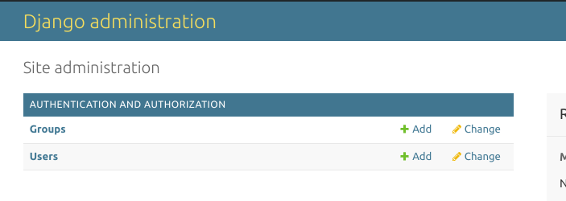

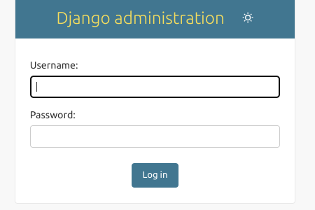

- Agregar myapp a panel de admin

Directorio: polls/admin.py

```
from django.contrib import admin

from .models import Question

admin.site.register(Question)
```

## Parte 3 Vistas y rutas

- Nuevas vistas y parametros en la url

Directorio: polls/views.py
```
def detail(request, question_id):
    return HttpResponse("You're looking at question %s." % question_id)


def results(request, question_id):
    response = "You're looking at the results of question %s."
    return HttpResponse(response % question_id)


def vote(request, question_id):
    return HttpResponse("You're voting on question %s." % question_id)
```

Directorio: polls/urls.py
```
from django.urls import path

from . import views

urlpatterns = [
    # ex: /polls/
    path("", views.index, name="index"),
    # ex: /polls/5/
    path("<int:question_id>/", views.detail, name="detail"),
    # ex: /polls/5/results/
    path("<int:question_id>/results/", views.results, name="results"),
    # ex: /polls/5/vote/
    path("<int:question_id>/vote/", views.vote, name="vote"),
]
```
Nuevas urls:
  - http://localhost:8000/polls/1/
  - http://localhost:8000/polls/1/results/
  - http://localhost:8000/polls/1/vote/

- Modificar la vista principal de polls

Directorio: http://localhost:8000/polls/
En esta vista listaremos las preguntas y las agregaremos a la interfaz

```
from django.http import HttpResponse

from .models import Question


def index(request):
    latest_question_list = Question.objects.order_by("-pub_date")[:5]
    output = ", ".join([q.question_text for q in latest_question_list])
    return HttpResponse(output)
```

- Crear una plantilla html 

Directorio: /templates/polls/index.html
```

    <ul>
    
        <li><a href="/polls/{{ question.id }}/">{{ question.question_text }}</a></li>
    
    </ul>

    <p>No polls are available.</p>

```
- Implementar la plantilla en la vista

Directorio: polls/views.py
```
from django.http import HttpResponse
from django.template import loader

from .models import Question


def index(request):
    latest_question_list = Question.objects.order_by("-pub_date")[:5]
    # Obtener template
    template = loader.get_template("polls/index.html")
    # Pasar datos a la vista
    context = {
        "latest_question_list": latest_question_list,
    }
    # Retornar la vista con los datos
    return HttpResponse(template.render(context, request))
```
- Simplificar el codigo con render()

Directorio: polls/views.py
```
from django.shortcuts import render

from .models import Question


def index(request):
    latest_question_list = Question.objects.order_by("-pub_date")[:5]
    context = {"latest_question_list": latest_question_list}
    return render(request, "polls/index.html", context)
```

- Modificar vista de detalle y agregar template con excepciones

Directorio: polls/views.py
```
from django.http import Http404
from django.shortcuts import render
from .models import Question


# ...
def detail(request, question_id):
    try:
        question = Question.objects.get(pk=question_id)
    except Question.DoesNotExist:
        raise Http404("Question does not exist")
    return render(request, "polls/detail.html", {"question": question})
```
- Simplificar el codigo de pagina detalle 

Directorio: polls/views.py
```
from django.shortcuts import get_object_or_404, render

from .models import Question


# ...
def detail(request, question_id):
    question = get_object_or_404(Question, pk=question_id)
    return render(request, "polls/detail.html", {"question": question})
```

- Modificar el template de detalle

Directorio: template/polls/detail.html

Accerder a datos para mostrarlos en la vista
```
<h1>{{ question.question_text }}</h1>
<ul>

    <li>{{ choice.choice_text }}</li>

</ul>
```

- Modificar el template de index cambiar la forma de uso de urls

Directorio: template/polls/index.html

Se utiliza el name unico para identificar la url
```
<h1>{{ question.question_text }}</h1>
<ul>

   <li><a href="">{{ question.question_text }}</a></li>

</ul>
```

- Evitar conflitos por nombres de url

Directorio: polls/urls.py
```
from django.urls import path

from . import views

app_name = "polls"
urlpatterns = [
    path("", views.index, name="index"),
    path("<int:question_id>/", views.detail, name="detail"),
    path("<int:question_id>/results/", views.results, name="results"),
    path("<int:question_id>/vote/", views.vote, name="vote"),
]
```
Para ello se agrega un nombre a la app
```
<li><a href="">{{ question.question_text }}</a></li>
```

## Parte 4 Implementación de interación con la pagina y datos en bd

- Actualización de la pagina detail

Directorio: template/polls/detail.html
```
<form action="" method="post">
    
    <fieldset>
        <legend><h1>{{ question.question_text }}</h1></legend>
        <p><strong>{{ error_message }}</strong></p>
        
            <input type="radio" name="choice" id="choice{{ forloop.counter }}" value="{{ choice.id }}">
            <label for="choice{{ forloop.counter }}">{{ choice.choice_text }}</label><br>
        
    </fieldset>
    <input type="submit" value="Vote">
</form>
```

- Actualizar la vista que recibe los datos del form y bd

Directorio: polls/views.py:
```
from django.db.models import F
from django.http import HttpResponse, HttpResponseRedirect
from django.shortcuts import get_object_or_404, render
from django.urls import reverse

from .models import Choice, Question

# ...
def vote(request, question_id):
    question = get_object_or_404(Question, pk=question_id)
    try:
        selected_choice = question.choice_set.get(pk=request.POST["choice"])
    except (KeyError, Choice.DoesNotExist):
        # Redisplay the question voting form.
        return render(
            request,
            "polls/detail.html",
            {
                "question": question,
                "error_message": "You didn't select a choice.",
            },
        )
    else:
        selected_choice.votes = F("votes") + 1
        selected_choice.save()
        # Always return an HttpResponseRedirect after successfully dealing
        # with POST data. This prevents data from being posted twice if a
        # user hits the Back button.
        return HttpResponseRedirect(reverse("polls:results", args=(question.id,)))
```

- Actualizar vista de reultados

Directorio: polls/views.py:
```
from django.shortcuts import get_object_or_404, render


def results(request, question_id):
    question = get_object_or_404(Question, pk=question_id)
    return render(request, "polls/results.html", {"question": question})
```

- Crear template de resultados

```
  Directorio: polls/results.html
  
  <h1>{{ question.question_text }}</h1>
  
  <ul>
  
      <li>{{ choice.choice_text }} -- {{ choice.votes }} vote{{ choice.votes|pluralize }}</li>
  
  </ul>
  
  <a href="">Vote again?</a>
```

- Usar vistas genéricas

Primero se modifica el archivo polls/urls.py
```
from django.urls import path

from . import views

app_name = "polls"
urlpatterns = [
    path("", views.IndexView.as_view(), name="index"),
    path("<int:pk>/", views.DetailView.as_view(), name="detail"),
    path("<int:pk>/results/", views.ResultsView.as_view(), name="results"),
    path("<int:question_id>/vote/", views.vote, name="vote"),
]
```

Luego se modificar el archivo polls/views.py, para utilizar vistas genericas
```
from django.db.models import F
from django.http import HttpResponseRedirect
from django.shortcuts import get_object_or_404, render
from django.urls import reverse
from django.views import generic

from .models import Choice, Question


class IndexView(generic.ListView):
    template_name = "polls/index.html"
    context_object_name = "latest_question_list"

    def get_queryset(self):
        """Return the last five published questions."""
        return Question.objects.order_by("-pub_date")[:5]


class DetailView(generic.DetailView):
    model = Question
    template_name = "polls/detail.html"


class ResultsView(generic.DetailView):
    model = Question
    template_name = "polls/results.html"


def vote(request, question_id):
    # same as above, no changes needed.
    ...
```

## Parte 5 Pruebas automatizadas
El fin de las pruebas automatizadas es identificar errores y prevenirlos.
La app creada polls tiene un error el cual sera estudiado para luego hacer una prueba

- Ingresamos al shell 
```
python manage.py shell

>>> import datetime
>>> from django.utils import timezone
>>> from polls.models import Question
>>> # create a Question instance with pub_date 30 days in the future
>>> future_question = Question(pub_date=timezone.now() + datetime.timedelta(days=30))
>>> # was it published recently?
>>> future_question.was_published_recently()
True
```
El error consiste en que se puede publicar encuesta a futuro y nuestro metodo que verifica 
si una publicacion es reciente indica que True, metodo que se encuentra en el models.py de polls

- Crear una pueba para evidenciar el error

Directorio: polls/test.py
```
import datetime

from django.test import TestCase
from django.utils import timezone

from .models import Question


class QuestionModelTests(TestCase):
    def test_was_published_recently_with_future_question(self):
        """
        was_published_recently() returns False for questions whose pub_date
        is in the future.
        """
        time = timezone.now() + datetime.timedelta(days=30)
        future_question = Question(pub_date=time)
        self.assertIs(future_question.was_published_recently(), False)
```
Este test crea una encuesta y verifica que su resultado sea False, pero como hay un error en consola indica
que el resultado debio ser falso

- Ejecutar la prueba creada
```
python manage.py test polls
```
- Correción del error 

Una vez identificado el error, se debe implementar una solución
Directorio: polls/models.py
```
def was_published_recently(self):
    now = timezone.now()
    return now - datetime.timedelta(days=1) <= self.pub_date <= now
```

- Ejecutar nuevamente el test
```
python manage.py test polls
```
Resultado deberia ser ok, es decir prueba exitosa

- Pruebas más completas

Implementar pruebas mas completas que tomen en cuenta casos de exito y de error

Directorio: polls/test.py
```
import datetime

from django.test import TestCase
from django.utils import timezone

from .models import Question


class QuestionModelTests(TestCase):
    def test_was_published_recently_with_old_question(self):
    """
    was_published_recently() returns False for questions whose pub_date
    is older than 1 day.
    """
    time = timezone.now() - datetime.timedelta(days=1, seconds=1)
    old_question = Question(pub_date=time)
    self.assertIs(old_question.was_published_recently(), False)


def test_was_published_recently_with_recent_question(self):
    """
    was_published_recently() returns True for questions whose pub_date
    is within the last day.
    """
    time = timezone.now() - datetime.timedelta(hours=23, minutes=59, seconds=59)
    recent_question = Question(pub_date=time)
    self.assertIs(recent_question.was_published_recently(), True)
```

- El cliente de prueba de Django
```
python manage.py shell
>>> from django.test.utils import setup_test_environment
>>> setup_test_environment()
>>> from django.test import Client
>>> # create an instance of the client for our use
>>> client = Client()
>>> # get a response from '/'
>>> response = client.get("/")
Not Found: /
>>> # we should expect a 404 from that address; if you instead see an
>>> # "Invalid HTTP_HOST header" error and a 400 response, you probably
>>> # omitted the setup_test_environment() call described earlier.
>>> response.status_code
404
>>> # on the other hand we should expect to find something at '/polls/'
>>> # we'll use 'reverse()' rather than a hardcoded URL
>>> from django.urls import reverse
>>> response = client.get(reverse("polls:index"))
>>> response.status_code
200
>>> response.content
b'\n    <ul>\n    \n        <li><a href="/polls/1/">What&#x27;s up?</a></li>\n    \n    </ul>\n\n'
>>> response.context["latest_question_list"]
<QuerySet [<Question: What's up?>]>
```

Permite probar la interfaz y los resultados que se deben obtener

- Mejorar vista para que solo muestre las encuestas que se han publicado
```
class IndexView(generic.ListView):
    template_name = "polls/index.html"
    context_object_name = "latest_question_list"

    def get_queryset(self):
    """
    Return the last five published questions (not including those set to be
    published in the future).
    """
    return Question.objects.filter(pub_date__lte=timezone.now()).order_by("-pub_date")[:5]
```
En la condición de filtrado se establece que debe ser una fecha de publicación menor o igual a la actual

- Probar nuestra nueva vista
```
import datetime

from django.test import TestCase
from django.utils import timezone
from django.urls import reverse
from .models import Question

def create_question(question_text, days):
    """
    Create a question with the given `question_text` and published the
    given number of `days` offset to now (negative for questions published
    in the past, positive for questions that have yet to be published).
    """
    time = timezone.now() + datetime.timedelta(days=days)
    return Question.objects.create(question_text=question_text, pub_date=time)

class QuestionModelTests(TestCase):
    def test_was_published_recently_with_old_question(self):
        """
        was_published_recently() returns False for questions whose pub_date
        is older than 1 day.
        """
        time = timezone.now() - datetime.timedelta(days=1, seconds=1)
        old_question = Question(pub_date=time)
        self.assertIs(old_question.was_published_recently(), False)

    def test_was_published_recently_with_recent_question(self):
        """
        was_published_recently() returns True for questions whose pub_date
        is within the last day.
        """
        time = timezone.now() - datetime.timedelta(hours=23, minutes=59, seconds=59)
        recent_question = Question(pub_date=time)
        self.assertIs(recent_question.was_published_recently(), True)

    def test_no_questions(self):
        """
        If no questions exist, an appropriate message is displayed.
        """
        response = self.client.get(reverse("polls:index"))
        self.assertEqual(response.status_code, 200)
        self.assertContains(response, "No polls are available.")
        self.assertQuerySetEqual(response.context["latest_question_list"], [])

    def test_past_question(self):
        """
        Questions with a pub_date in the past are displayed on the
        index page.
        """
        question = create_question(question_text="Past question.", days=-30)
        response = self.client.get(reverse("polls:index"))
        self.assertQuerySetEqual(
            response.context["latest_question_list"],
            [question],
        )

    def test_future_question(self):
        """
        Questions with a pub_date in the future aren't displayed on
        the index page.
        """
        create_question(question_text="Future question.", days=30)
        response = self.client.get(reverse("polls:index"))
        self.assertContains(response, "No polls are available.")
        self.assertQuerySetEqual(response.context["latest_question_list"], [])

    def test_future_question_and_past_question(self):
        """
        Even if both past and future questions exist, only past questions
        are displayed.
        """
        question = create_question(question_text="Past question.", days=-30)
        create_question(question_text="Future question.", days=30)
        response = self.client.get(reverse("polls:index"))
        self.assertQuerySetEqual(
            response.context["latest_question_list"],
            [question],
        )

    def test_two_past_questions(self):
        """
        The questions index page may display multiple questions.
        """
        question1 = create_question(question_text="Past question 1.", days=-30)
        question2 = create_question(question_text="Past question 2.", days=-5)
        response = self.client.get(reverse("polls:index"))
        self.assertQuerySetEqual(
            response.context["latest_question_list"],
            [question2, question1],
        )
```
Primero es una función de atajo de preguntas, create_question, para tomar un poco repetición fuera del proceso de creación de preguntas.

test_no_questions no crea ninguna pregunta, pero comprueba el mensaje: “No hay encuestas disponibles.” y verifica el latest_question_list está vacío. Tenga en cuenta que el django.test.TestCase la clase proporciona algunos adicionales métodos de afirmación. En estos ejemplos, usamos assertContains() y assertQuerySetEqual().

En test_past_question, creamos una pregunta y verificamos que aparezca en la lista.

En test_future_question, creamos una pregunta con un pub_date en el futuro. La base de datos se restablece para cada método de prueba, por lo que la primera pregunta es no más tiempo allí, y así nuevamente el índice no debería tener ninguna pregunta.

Y así sucesivamente. En efecto, estamos utilizando las pruebas para contar una historia de entrada de administrador y la experiencia del usuario en el sitio, y comprobar eso en cada estado y para cada nuevo cambio en el estado del sistema, se publican los resultados esperados.

- Probando el DetailView

Directorio: polls/views.py
```
class DetailView(generic.DetailView):
    ...

    def get_queryset(self):
        """
        Excludes any questions that aren't published yet.
        """
        return Question.objects.filter(pub_date__lte=timezone.now())
```

Directorio: polls/test.py
```
class QuestionDetailViewTests(TestCase):
    def test_future_question(self):
        """
        The detail view of a question with a pub_date in the future
        returns a 404 not found.
        """
        future_question = create_question(question_text="Future question.", days=5)
        url = reverse("polls:detail", args=(future_question.id,))
        response = self.client.get(url)
        self.assertEqual(response.status_code, 404)

    def test_past_question(self):
        """
        The detail view of a question with a pub_date in the past
        displays the question's text.
        """
        past_question = create_question(question_text="Past Question.", days=-5)
        url = reverse("polls:detail", args=(past_question.id,))
        response = self.client.get(url)
        self.assertContains(response, past_question.question_text)

```

## Parte 6 Archivos estaticos

Implementacion de archivos css y imagenes

- Configurar estaticos 

Directorio: mysite/settings.py
```
import os

....
STATIC_URL = '/static/'
STATIC_ROOT = os.path.join(BASE_DIR, 'staticfiles')
STATICFILES_DIRS = [
    os.path.join(BASE_DIR, 'static'),
]
```

- Crear directorio de estaticos

Directorio: mysite/static
Sub-Directorio 1: mysite/static/img
Sub-Directorio 2: mysite/static/css

- Crear archivos estaticos

Directorio 1: mysite/static/img/fondo.png


Directorio 2: mysite/static/css/style.css
```
li a {
    color: green;
}
```

- Implementar estaticos en un template
```


<!doctype html>
<html lang="en">
<head>
    <meta charset="UTF-8">
    <meta name="viewport"
          content="width=device-width, user-scalable=no, initial-scale=1.0, maximum-scale=1.0, minimum-scale=1.0">
    <meta http-equiv="X-UA-Compatible" content="ie=edge">
    <link rel="stylesheet" href="">
    <title>Tutorial Django</title>
</head>
<body>
    
        <ul>
            
                {# <li><a href="/polls/{{ question.id }}/">{{ question.question_text }}</a></li>#}
                <li><a href="">{{ question.question_text }}</a></li>
            
        </ul>
    
        <p>No polls are available.</p>
    
</body>
</html>

```

- Implementar estaticos en un archivo css

Directorio: mysite/static/css/style.css
```
ul{
    padding: 40px;
    margin: 100px;
    background-color: #ffffff;
    border-radius: 10px;
}

li a {
    background-color: #ffffff;
    color: green;
}

body {
    height: 100vh;
    background: white url("../img/fondo.png") ;
    background-position: center;
    background-size: cover;
    background-repeat: no-repeat;
}
```

## Parte 7 Personalizar panel de administración

- Modificar el panel de administracion de nuestra app

Directorio: polls/admin.py
URL: http://localhost:8000/admin/polls/question/
```
from django.contrib import admin

from .models import Question


class QuestionAdmin(admin.ModelAdmin):
    fieldsets = [
        ("Name", {"fields": ["question_text"]}),
        ("Date information", {"fields": ["pub_date"]}),
    ]


admin.site.register(Question, QuestionAdmin)
```
- Agregar objetos relacionados

Con esta modificacion las opciones de la encuesta se integran dentro de la vista principal de encuestas
```
from django.contrib import admin
from .models import Choice, Question

class ChoiceInline(admin.StackedInline):
    model = Choice
    extra = 1
    
class QuestionAdmin(admin.ModelAdmin):
    fieldsets = [
        ("Name", {"fields": ["question_text"]}),
        ("Date information", {"fields": ["pub_date"]}),
    ]
    inlines = [ChoiceInline]


admin.site.register(Question, QuestionAdmin)
```

- Modificar el formulario de los objetos relacionados


Con eso TabularInline (en lugar de StackedInline), el los objetos relacionados se muestran en un formato más compacto basado en tablas:
```
from django.contrib import admin
from .models import Choice, Question

class ChoiceInline(admin.TabularInline):
    model = Choice
    extra = 1


class QuestionAdmin(admin.ModelAdmin):
    fieldsets = [
        ("Name", {"fields": ["question_text"]}),
        ("Date information", {"fields": ["pub_date"]}),
    ]
    inlines = [ChoiceInline]

admin.site.register(Question, QuestionAdmin)
```
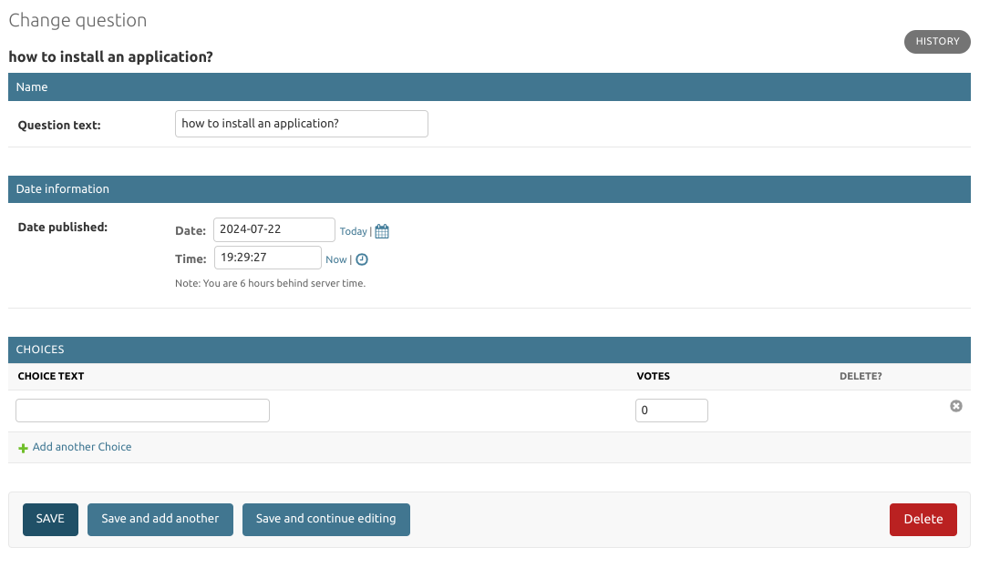

- Personalizar la lista de encuestas

```
from django.contrib import admin
from .models import Choice, Question

class ChoiceInline(admin.TabularInline):
    model = Choice
    extra = 1


class QuestionAdmin(admin.ModelAdmin):
    fieldsets = [
        ("Name", {"fields": ["question_text"]}),
        ("Date information", {"fields": ["pub_date"]}),
    ]
    inlines = [ChoiceInline]
    list_display = ["question_text", "pub_date", "was_published_recently"]

admin.site.register(Question, QuestionAdmin)
```

- Agregar un decorador al model que sera visible en el panel de admin lista de encuenstas
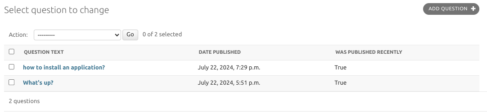
```
import datetime

from django.db import models
from django.utils import timezone
from django.contrib import admin

class Question(models.Model):
    question_text = models.CharField(max_length=200)
    pub_date = models.DateTimeField("date published")

    def __str__(self):
        return self.question_text
        
    @admin.display(
        boolean=True,
        ordering="pub_date",
        description="Published recently?",
    )
    def was_published_recently(self):
        now = timezone.now()
        return now - datetime.timedelta(days=1) <= self.pub_date <= now


class Choice(models.Model):
    question = models.ForeignKey(Question, on_delete=models.CASCADE)
    choice_text = models.CharField(max_length=200)
    votes = models.IntegerField(default=0)

    def __str__(self):
        return self.choice_text
```


- Agregar un filtros
```
from django.contrib import admin
from .models import Choice, Question

class ChoiceInline(admin.TabularInline):
    model = Choice
    extra = 1


class QuestionAdmin(admin.ModelAdmin):
    fieldsets = [
        ("Name", {"fields": ["question_text"]}),
        ("Date information", {"fields": ["pub_date"]}),
    ]
    inlines = [ChoiceInline]
    list_display = ["question_text", "pub_date", "was_published_recently"]
    list_filter = ["pub_date"]

admin.site.register(Question, QuestionAdmin)
```
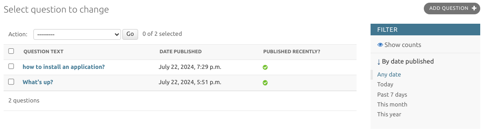

- Agregar un buscador
```
from django.contrib import admin
from .models import Choice, Question

class ChoiceInline(admin.TabularInline):
    model = Choice
    extra = 1


class QuestionAdmin(admin.ModelAdmin):
    fieldsets = [
        ("Name", {"fields": ["question_text"]}),
        ("Date information", {"fields": ["pub_date"]}),
    ]
    inlines = [ChoiceInline]
    list_display = ["question_text", "pub_date", "was_published_recently"]
    list_filter = ["pub_date"]
    search_fields = ["question_text"]

admin.site.register(Question, QuestionAdmin)
```
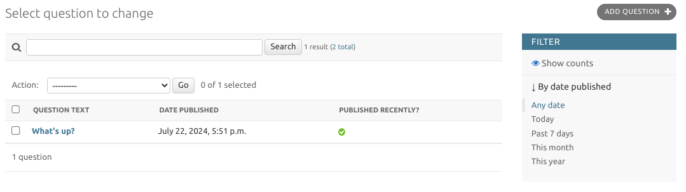

- Modificar el titulo del panel de admin

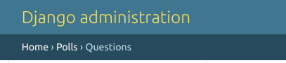
Primero debemos crear el directorio templates/admin
Luego el archivo base_site.html dentro del directorio templates/admin/base_site.html

Agregamos el codigo 
```



<div id="site-name"><a href="">Polls Administration</a></div>

  


```
El cual extiende de la plantilla base de django panel admin y modificamos el titulo,
tambien se puede personalizar otros aspectos

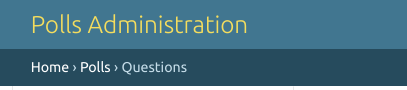

## Parte 8 Debug Toolbar

- Instalación de Debug Toolbar
```
python -m pip install django-debug-toolbar
```
['Documentación'](https://django-debug-toolbar.readthedocs.io/en/latest/installation.html)

- Agregarlo la app en settings

Directorio: mysite/settings.py
```
INSTALLED_APPS = [
    # ...
    "debug_toolbar",
]
```

- Agregarlo en las urls

Directorio: mysite/urls.py
```
from django.conf import settings
from django.conf.urls import include
from django.urls import path

urlpatterns = [
    ...
]

if settings.DEBUG:
    import debug_toolbar
    urlpatterns = [
        path('__debug__/', include(debug_toolbar.urls)),
    ] + urlpatterns
```
- Agregalor a Middleware

Directorio: mysite/settings.py
```
MIDDLEWARE = [
    # ...
    "debug_toolbar.middleware.DebugToolbarMiddleware",
    # ...
]
```

- Configuración para solo mostrarlo en entorno de desarrollo

Directorio: mysite/settings.py
Se puede agregar al final del archivo
```
INTERNAL_IPS = [
    '127.0.0.1:8001',
]
```

- Activar modo debug
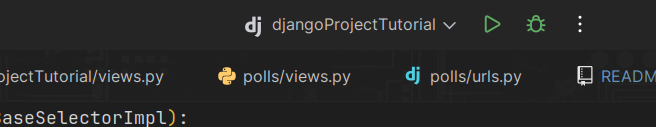

Se activa al darle click al botón del escarabajo 

URL: http://localhost:8000/
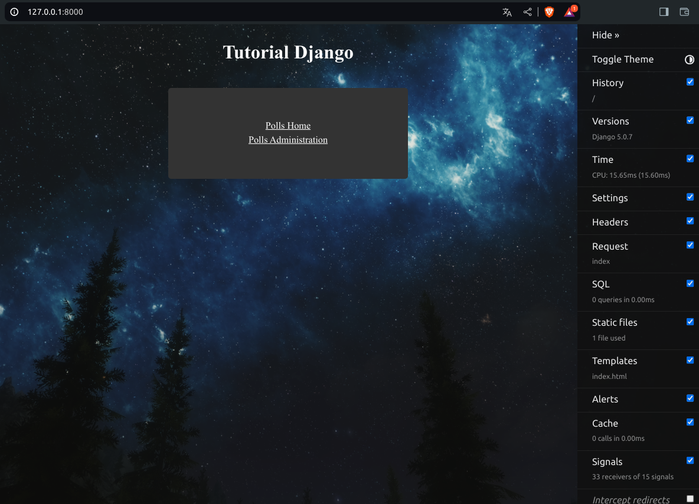

## Tutorial avanzado: Crear aplicaciones reutilizables

## Obtener ayuda de otros

['Foro de Django'](https://forum.djangoproject.com/)

['Discord de Django'](https://discord.gg/xcRH6mN4fa)

## Extras
- Agregar una vista principal

Primero creamos un archivo index.html en la carpeta templates
Directorio: mysite/templates/index

Agregamos el codigo html de la vista, para facilitar laexploracion de la aplicación

```

<!doctype html>
<html lang="en">
<head>
    <meta charset="UTF-8">
    <meta name="viewport"
          content="width=device-width, user-scalable=no, initial-scale=1.0, maximum-scale=1.0, minimum-scale=1.0">
    <meta http-equiv="X-UA-Compatible" content="ie=edge">
    <link rel="stylesheet" href="">
    <title>Tutorial django</title>
</head>
<body>
    
    <div class="container">
        <h1>Tutorial Django</h1>
         
        <div class="router">
            <a href="">Polls Home</a>
            <a href="">Polls Administration</a>
        </div>
    </div>
   
</body>
</html>
```

Modificamos el css
```
ul{
    padding: 40px;
    margin: 100px;
    background-color: #ffffff;
    border-radius: 10px;
}

li a {
    background-color: #ffffff;
    color: green;
}

body {
    height: 100vh;
    background: white url("../img/fondo.png") ;
    background-position: center;
    background-size: cover;
    background-repeat: no-repeat;
}

.container{
    width: 80%;
    margin: 0 auto;

    display: flex;
    flex-direction: column;
    align-items: center;
    justify-content: center;
}

.container h1{
    text-align: center;
    margin-bottom: 40px;
    color: #ffffff;
}

.router{
    margin-bottom: 20px;
    padding: 50px;
    background-color: #333333;
    color: #ffffff;
    border-radius: 5px;
    text-align: center;
    max-width: 300px;
    width: 100%;
}
.container a{
    display: block;
    color: #ffffff;
    margin: 5px;
}
```
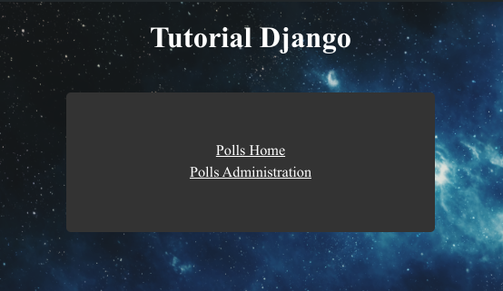

## Lista de comandos Django

1. Crear entorno virtual
```  
  python -m venv ./venv
```
   
2.  Activar el entorno virtual
```
    python -m venv ./venv/bin/activate
```

3. Crear un proyecto 
```   
    django-admin startproject <my_project>
```  
   
4. Crear una aplicación 
```   
    django-admin startapp <my_app>
```  
   
5. Compilar el proyecto 
```   
    python manage.py runserver
``` 
   
6. Generar archivo requirements.txt, si no lo tenemos o queremos actualizarlo
```   
  pip freeze > requirements.txt
```  
   
7. Install requirements 
```   
  pip install -r requirements.txt
```

8. Crear migraciones 
```   
  python manage.py migrate
```

9. Crear super usuario
```   
    python manage.py createsuperuser
```
   
10. Crear archivos estaticos
```
   python manage.py collectstatic
```  